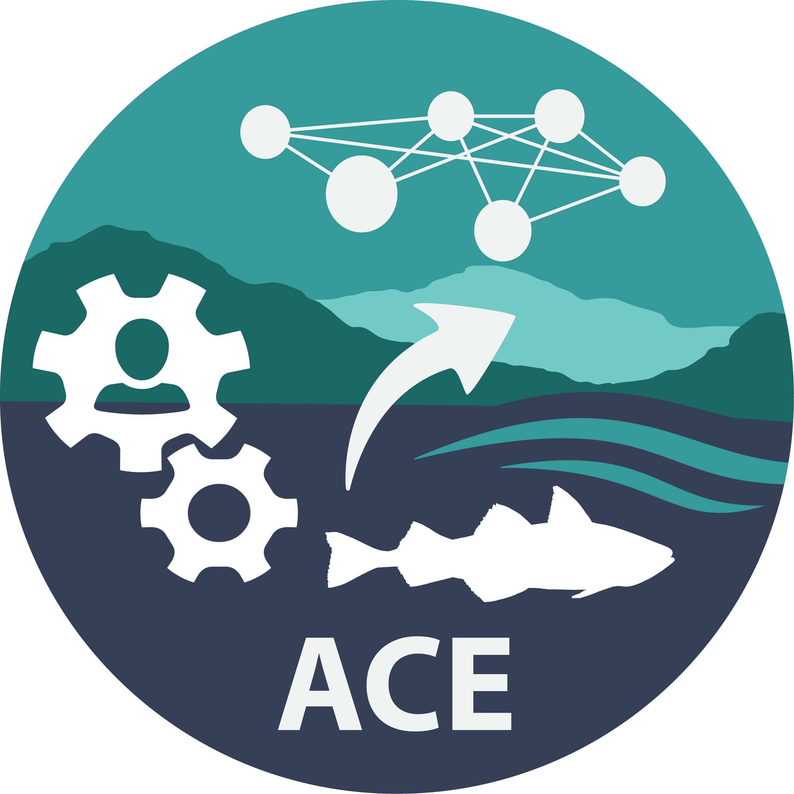
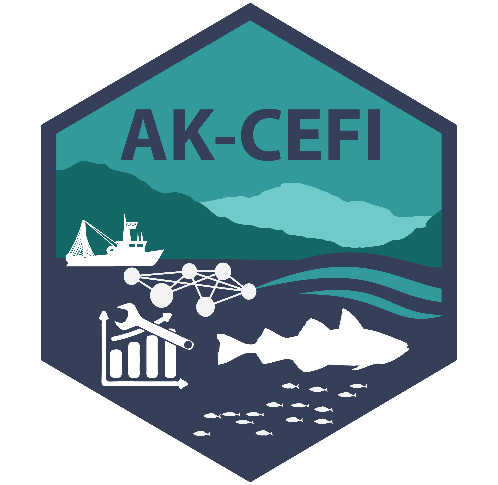
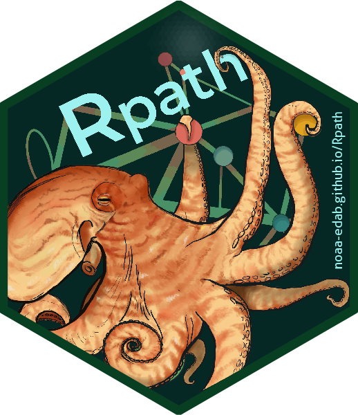

# Welcome to the Alaska NEAP (AK-NEAP) repo!
This is the public facing repository for the Alaska regional NEAP (NOAA National Ecosystem Assessment Program)team. As a first step please feel free to go to our discussion board and post an annoucement, idea or other comments. We'll use this public repo to collate ideas and feedback for our coordination to develop and implement tools, product, collabroations aand processes to support EBM in Alaska. 

Introduce yourself and join the discussion here:
https://github.com/noaa-afsc/NEAP-Alaska/discussions  

<!--
## Collaborators

If you have NMFS collaborators (i.e. have noaa.gov email) on your repository who are not members of the NMFS GitHub Enterprise Cloud account, have them complete a user request. If they are not NOAA FTEs or Affiliates, contact an administrator to help you add them to your repository or to transfer in your repository with outside collaborators. 

For repositories migrated to noaa-afsc organization
1. Update your README.md file to include the disclaimer and an open access license. See below for a description of licenses.
2. Add a description and info on who created the content (otherwise the org managers will not know who to contact).
3. Add tags (far right side on repo) to help users find repositories. See the other repositories for examples.
4. Add an open LICENSE file. For government work, we are required to use an open LICENSE. If non-government FTEs were contributors and the repository does not yet have an open license on it, make sure all parties agree before applying an open source license.
5. Add the file .github/workflows/secretScan.yml. This will check for token and keys that are accidentally committed to a repository.
-->
# Links
## Public

|| Link | Description |POC|
|--- | :--- | :----- |:--|
|| [ACE dashboard](https://ace.psmfc.org) | The Alaska Climate & Ecosystems dashboard: online hub for EBM information and tools||
|| [NOAA-CEFI-Alaska](https://github.com/noaa-afsc/NOAA-CEFI-Alaska) | Sub-team working to advance next generation ecosystem forecasting & planning tools ||
|| [Rpath()](https://github.com/NOAA-EDAB/Rpath) | R() based Ecosystem modeling ||
 
## Internal (NOAA)
|| Link | Description |POC|
|:--- | :--- | :----- |:--|
|| ['CEFI-AK'](https://github.com/noaa-afsc/AK-CEFI) | Internal github for the sub-team working to advance next generation ecosystem forecasting & planning tools ||

# AK-NEAP sub-Teams
coming soon!
<!--
| TEAM | Description |POC|
| :--- | :----- |:--|
| `ESR` | [ADD] ||
| `AK CEFI` | Sub-team working to advance next generation ecosystem forecasting & planning tools ||
| `ESPs` | [ADD] ||
| `ADD` | [ADD] ||
-->
# Disclaimer

This repository is a scientific product and is not official communication of the National Oceanic and Atmospheric Administration, or the United States Department of Commerce. All NOAA GitHub project content is provided on an "as is" basis and the user assumes responsibility for its use. Any claims against the Department of Commerce or Department of Commerce bureaus stemming from the use of this GitHub project will be governed by all applicable Federal law. Any reference to specific commercial products, processes, or services by service mark, trademark, manufacturer, or otherwise, does not constitute or imply their endorsement, recommendation or favoring by the Department of Commerce. The Department of Commerce seal and logo, or the seal and logo of a DOC bureau, shall not be used in any manner to imply endorsement of any commercial product or activity by DOC or the United States Government.
